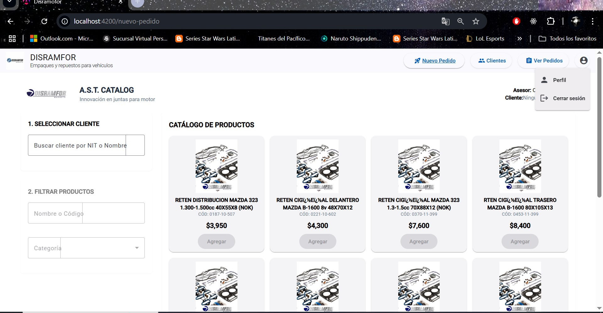

# Disramofor

This project was generated using [Angular CLI](https://github.com/angular/angular-cli) version 19.2.6.

## Development server

To start a local development server, run:

```bash
ng serve
```

Once the server is running, open your browser and navigate to `http://localhost:4200/`. The application will automatically reload whenever you modify any of the source files.

## Code scaffolding

Angular CLI includes powerful code scaffolding tools. To generate a new component, run:

```bash
ng generate component component-name
```

For a complete list of available schematics (such as `components`, `directives`, or `pipes`), run:

```bash
ng generate --help
```

## Building

To build the project run:

```bash
ng build
```

This will compile your project and store the build artifacts in the `dist/` directory. By default, the production build optimizes your application for performance and speed.

## Running unit tests

To execute unit tests with the [Karma](https://karma-runner.github.io) test runner, use the following command:

```bash
ng test
```

## Running end-to-end tests

For end-to-end (e2e) testing, run:

```bash
ng e2e
```

Angular CLI does not come with an end-to-end testing framework by default. You can choose one that suits your needs.

## Additional Resources

For more information on using the Angular CLI, including detailed command references, visit the [Angular CLI Overview and Command Reference](https://angular.dev/tools/cli) page.


# 🖥️ Front-end – Sistema de Gestión Comercial (Angular)

Bienvenido al front-end de la aplicación de gestión comercial. Esta interfaz fue desarrollada en **Angular** con enfoque modular, usando **Angular Material**, **Tailwind CSS** y herramientas modernas para generar reportes PDF y Excel, facilitando la gestión de pedidos y clientes en un entorno visual limpio y eficiente.

---

## 📘 ¿Qué hace este módulo?

- 🧾 Visualiza pedidos, clientes y productos de forma estructurada.
- 🧮 Permite crear, editar y eliminar registros (CRUD).
- 📊 Exporta reportes en **PDF y Excel** al instante.
- 📱 Cuenta con diseño responsivo y accesible gracias a Angular Material + Tailwind.

---

## 🧭 Arquitectura del Front-end

### 📁 Organización por funcionalidad
La app sigue una estructura **feature-based**, con carpetas como:

src/app/

├── clientes/ # Componentes para cliente-list y cliente-form

├── features/centro-pedidos/ # Componentes relacionados a pedidos

├── model/ # Interfaces TypeScript para clientes, productos, etc.

├── service/ # Servicios HTTP que consumen la API REST

├── shared/ # Navbar y otros componentes comunes


### 🧰 Tecnologías clave

- Angular 17+
- Angular Material
- Tailwind CSS
- RxJS
- TypeScript
- jsPDF, html2canvas, xlsx, file-saver

---

## 🔗 Documentación Oficial (Muy Importante)

> 📚 La **documentación técnica completa** de este front-end se encuentra publicada en Notion:
>
> 👉 [Ver documentación Front-end en Notion](https://petalite-pail-bb4.notion.site/Sistema-Degestion-De-pedidos-y-inventarios-Disramfor-1f8d6cfba8ba80e18683f4119d5556ce)

Ahí encontrarás:

- Diagramas visuales
- Explicación de estructura y dependencias
- Casos de uso y flujos de trabajo
- Buenas prácticas para nuevos desarrolladores

---

## 🖼️ Capturas del sistema (Pantallazos recomendados)

Asegúrate de agregar imágenes que representen:

- Página principal o dashboard con navegación (`navbar`)
- Vista de lista de clientes (`cliente-list`)
- Formulario de cliente (`cliente-form`)
- Vista de pedidos o productos
- Ejemplo de exportación a PDF o Excel

Puedes colocarlas así:

```markdown
### 🧾 Vista de listado de clientes

[](https://github.com/tu-usuario/tu-repo/blob/master/src/assets/1.jpg?raw=true
)

### 📝 Formulario para agregar cliente


# Instalar dependencias
npm install

# Ejecutar servidor de desarrollo
ng serve
La app se cargará en http://localhost:4200


